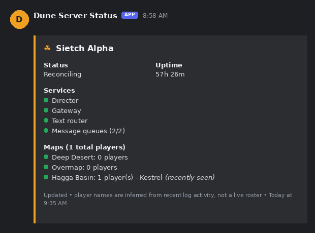

# dune-discord-status

A Discord bot that posts and keeps updating a live status embed for a
self-hosted **Dune Awakening** battlegroup server — overall health, uptime,
service status, and per-map player counts (with a best-effort guess at
recently-active player names).



*(Example with placeholder server/player names — yours will show your own.)*

It works by SSHing into your server's host and running `kubectl` against
the `igw.funcom.com/v1` `BattleGroup` and `ServerStats` custom resources
that the official self-hosting stack creates. No game mods, no reverse
engineering of the game client — just reading data your own Kubernetes
cluster already exposes.

## Before you start: what this does NOT do

This is **status monitoring only** — it does not relay chat between
Discord and the game (no "cross-chat"). As of this writing there's no
documented, working mechanism to read or inject live in-game chat for
self-hosted Dune Awakening servers. If that changes, contributions welcome.

## Prerequisites

- A self-hosted Dune Awakening battlegroup already up and running (Windows
  + Hyper-V official path, or a Linux/KVM setup — either works, as long as
  you can SSH into the host and run `kubectl`)
- SSH access to that host from wherever you'll run this bot
- A place to run a Docker container (this was built and tested running on
  Unraid, but any Docker host works)
- A Discord bot application (free, takes a few minutes — see below)

## 1. Create the Discord bot

1. [Discord Developer Portal](https://discord.com/developers/applications) → **New Application** → **Bot** tab → **Add Bot** → copy the token
2. This bot only *posts* messages — you do **not** need Message Content Intent
3. **OAuth2 → URL Generator**: scope `bot`, permissions **View Channels**, **Send Messages**, **Embed Links** → use the generated URL to invite it to your server
4. Enable Developer Mode in Discord (User Settings → Advanced), then right-click your target channel → **Copy Channel ID**

## 2. Set up SSH key access to your server host

From wherever you'll run the bot:
```bash
ssh-keygen -t ed25519 -f ./dune_status_key -N "" -C "dune-status-bot"
```

Copy the public key to your server host's `authorized_keys` (adjust user/host):
```bash
cat dune_status_key.pub | ssh youruser@your-server-host "mkdir -p ~/.ssh && chmod 700 ~/.ssh && cat >> ~/.ssh/authorized_keys && chmod 600 ~/.ssh/authorized_keys"
```

Test it:
```bash
ssh -i ./dune_status_key youruser@your-server-host "echo ok"
```
Should print `ok` with no password prompt.

## 3. Make sure `kubectl` works for your SSH user (no sudo)

By default, k3s's kubeconfig is often root-owned. On the server host:
```bash
mkdir -p ~/.kube
sudo cat /etc/rancher/k3s/k3s.yaml > ~/.kube/config
chmod 600 ~/.kube/config
echo 'export KUBECONFIG=~/.kube/config' >> ~/.bashrc
source ~/.bashrc
kubectl get pods -A
```
If that lists pods without `sudo`, you're set.

**Important:** note the *full absolute path* to your kubeconfig (e.g.
`/home/youruser/.kube/config`) — you'll need it in step 6.
Also run `which kubectl` and note that full path too.

## 4. Find your namespace and battlegroup name

These are unique to your installation — the bot needs them exactly.

```bash
kubectl get namespaces
```
Look for one that isn't `default`/`kube-system`/etc. — it'll look like
`funcom-seabass-<some-id>`.

```bash
kubectl get battlegroups -n <that-namespace>
```
The `NAME` column is your `BATTLEGROUP_NAME`.

## 5. Configure

```bash
cp .env.example .env
```
Fill in every field — see the comments in `.env.example` for what each
one means. Two easy mistakes to avoid, both learned the hard way:
- **`KUBECONFIG_PATH` must be an absolute path**, not `~/.kube/config` —
  the bot's SSH command runs non-interactively, and shell quoting for
  safety disables `~` expansion in that context.
- **`KUBECTL_PATH` must be the full path** from `which kubectl` in step 3
  — non-interactive SSH commands don't source your `.bashrc`, so `PATH`
  additions won't apply.

## 6. Build and run

```bash
docker build -t dune-discord-status .
docker run -d \
  --name dune-discord-status \
  --restart unless-stopped \
  --env-file .env \
  -v $(pwd)/dune_status_key:/keys/dune_status_key:ro \
  -v $(pwd)/data:/data \
  dune-discord-status
```

The two volume mounts: your SSH private key (read-only), and a `/data`
folder where the bot persists which Discord message it's editing, so
restarts don't spam a new message every time.

## 7. Verify

```bash
docker logs dune-discord-status
```
Look for a successful Discord login and SSH authentication, no errors.
Within `POLL_INTERVAL_SECONDS` (60s default), a status embed should
appear in your Discord channel and keep updating in place.

## About the player names feature

There's no structured API for player identity, so this is inferred by
tailing each active map's pod logs and pattern-matching on lines like
`for player SomeName (FLS: ...)`. That means:
- A name shown means "seen recently in the log tail," not "guaranteed
  online right now."
- If nobody's (re)logged in recently, you'll see the player count with no
  name attached.
- This depends on an internal, undocumented log format that could change
  with a future game update. If it silently stops working, that's likely
  why — please open an issue if you notice this.

## Troubleshooting

- **`kubectl: command not found` in bot logs** — `KUBECTL_PATH` isn't the
  full absolute path.
- **`dial tcp [::1]:8080: connect: connection refused`** — `KUBECONFIG_PATH`
  is using `~` instead of an absolute path.
- **SSH errors** — test the exact command manually first:
  ```bash
  ssh -i ./dune_status_key youruser@your-server-host "echo ok"
  ```
- **Battlegroup redeployed** — if you ever tear down and recreate your
  battlegroup, `K8S_NAMESPACE` and `BATTLEGROUP_NAME` will change; repeat
  step 4.

## Contributing

Issues and PRs welcome — this is young, community-built tooling for a
young self-hosting ecosystem. In particular, if you find a way to enable
real cross-chat, or the player-name log pattern breaks on a future game
version, please open an issue.

## License

MIT — see [LICENSE](LICENSE).
